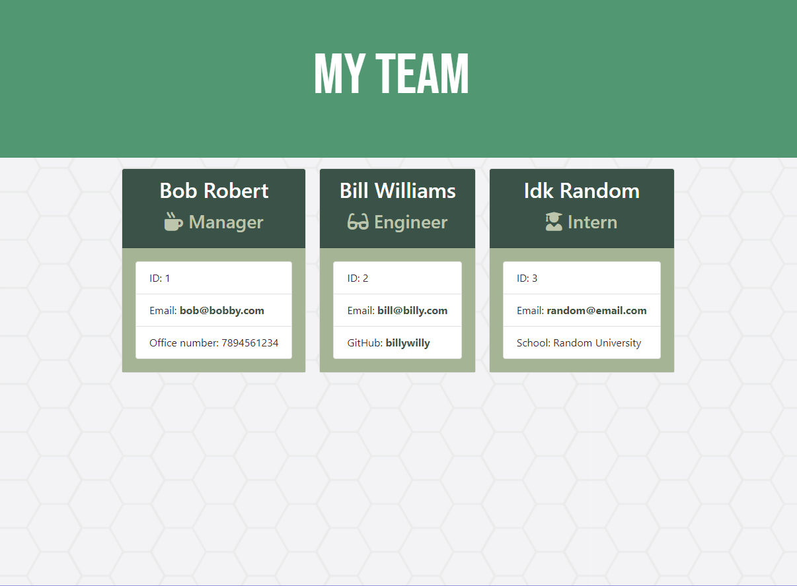

# "Who Are We?" Generator

## Description
This is a team profile generator that generates an HTML page using Node CLI responses. The HTML page generates the name of the person, their role in the team, their email address, and other information such as phone number, Github username or university name. This application makes use of Node.js and depends on the package Inquirer.

## Installation
- Clone the repository to your local machine, then in order to install dependencies, run:
```
npm install
```

## Usage
- Navigate to the "Develop" folder, then in your terminal window, run:
```
node app.js
```
- Answer the prompted questions
- Navigate to the "/Develop/output" folder to view the generated HTML webpage

To view a video demo, click [here](https://drive.google.com/file/d/1uuRjh4vxK2DhqnSjoPtVCKG5grNikg1o/view?usp=sharing).



## License
 MIT License

Copyright (c) 2020 Jonnah Marie Pangilinan

Permission is hereby granted, free of charge, to any person obtaining a copy
of this software and associated documentation files (the "Software"), to deal
in the Software without restriction, including without limitation the rights
to use, copy, modify, merge, publish, distribute, sublicense, and/or sell
copies of the Software, and to permit persons to whom the Software is
furnished to do so, subject to the following conditions:

The above copyright notice and this permission notice shall be included in all
copies or substantial portions of the Software.

THE SOFTWARE IS PROVIDED "AS IS", WITHOUT WARRANTY OF ANY KIND, EXPRESS OR
IMPLIED, INCLUDING BUT NOT LIMITED TO THE WARRANTIES OF MERCHANTABILITY,
FITNESS FOR A PARTICULAR PURPOSE AND NONINFRINGEMENT. IN NO EVENT SHALL THE
AUTHORS OR COPYRIGHT HOLDERS BE LIABLE FOR ANY CLAIM, DAMAGES OR OTHER
LIABILITY, WHETHER IN AN ACTION OF CONTRACT, TORT OR OTHERWISE, ARISING FROM,
OUT OF OR IN CONNECTION WITH THE SOFTWARE OR THE USE OR OTHER DEALINGS IN THE
SOFTWARE.